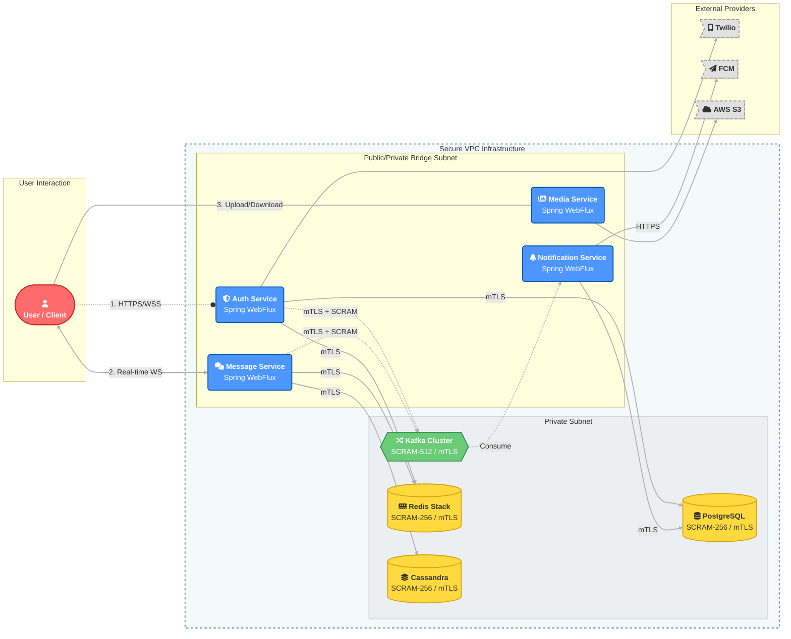

# Lynk | Reactive Communication Platform


**Lynk** is a high-performance, distributed real-time communication platform engineered on the reactive principles of **Spring WebFlux**. Designed for massive concurrency and low-latency throughput, it leverages a non-blocking event-loop architecture to handle thousands of concurrent connections with minimal resource overhead.

The system employs an event-driven architecture using **Apache Kafka** for asynchronous decoupling, **Cassandra** for write-heavy chat logs, and **Redis** for high-speed caching.

> **Security Notice:** Lynk implements a Zero-Trust security model with end-to-end mTLS, strict SCRAM authentication, and rigorous network segmentation between public-facing services and private data infrastructure.

---

## 🏗 High-Level Architecture

The platform follows a domain-driven microservices architecture hosted within a VPC-like environment. The network is segmented into **Public/Private Bridge** subnets for microservices and strict **Private Subnets** for the data layer, ensuring databases and message brokers are never exposed to the public internet.



---

## 🔒 Security & Infrastructure

Lynk goes beyond standard security practices by implementing a hardened, defense-in-depth infrastructure strategy.

### 1. Network Segmentation (VPC)
*   **Private Subnet:** All persistence layers (Postgres, Cassandra, Redis) and the Event Bus (Kafka) reside in a strictly isolated private subnet. They are inaccessible from the public internet.
*   **Public/Private Bridge:** Microservices act as the gatekeepers. They are dual-homed: accessible via public load balancers for client traffic, but connected internally to the private subnet to access data.

### 2. Mutual TLS (mTLS) Encryption
Every internal connection requires mutual authentication. It is not enough to simply trust the network; services must cryptographically prove their identity to the databases.
*   **Implemented on:** Redis, Cassandra, PostgreSQL, and Kafka.
*   **Mechanism:** Self-signed CA governance with individual certificate generation for every service instance.

### 3. Advanced Authentication (SCRAM)
We strictly avoid cleartext passwords, utilizing Salted Challenge Response Authentication Mechanisms (SCRAM) for all connections.
*   **Kafka:** Implements **SCRAM-SHA-512** for the highest level of cryptographic strength on the event bus.
*   **Databases:** Redis, PostgreSQL, and Cassandra utilize **SCRAM-SHA-256**.

### 4. Granular Authorization (ACLs)
Implementation of the "Principle of The Least Privilege":
*   **Kafka ACLs:** Topic-level authorization is enforced.
    *   *Example:* The `notification-service` has `READ` permission on the `message.created` topic but cannot `WRITE` to it. The `auth-service` cannot access chat logs.
*   **Database RBAC:** Service users are restricted to specific tables and operations (SELECT/INSERT) relevant only to their domain.

---

## ⚡ Key Design Decisions

*   **Reactive Model (Project Reactor):** Chosen over the traditional thread-per-request model to handle high I/O wait times (DB, Network) without blocking threads, maximizing hardware utilization.
*   **Cassandra for Chat Logs:** Utilizes a Wide-Column Store for its high write throughput and ability to model time-series data (chat history) efficiently.
*   **Probabilistic Data Structures:** Implements **Redis Cuckoo Filters** for room name availability checks ($O(1)$ space-efficient lookups).
*   **Zero-Trust Architecture:** The decision to implement mTLS and SCRAM across all internal components ensures that a perimeter breach does not lead to lateral movement or data compromise.

---

## 🛠 Service Breakdown

### 🛡 Auth Service (`auth-service`)
*   **Role:** Identity Gateway.
*   **Security:** Handles JWT issuance and rotation. Connects to Postgres via mTLS/SCRAM-256.
*   **MFA:** Twilio SMS OTP and TOTP.

### 💬 Message Service (`message-service`)
*   **Role:** WebSocket Engine.
*   **Persistence:** Writes chat logs to Cassandra (mTLS secured).
*   **Events:** Publishes `message.received` events to Kafka (SCRAM-512 secured).

### 🔔 Notification Service (`notification-service`)
*   **Role:** Async Consumer.
*   **Access:** Read-only ACL access to Kafka topics.

### 📂 Media Service (`media-service`)
*   **Role:** Binary Management.
*   **Storage:** AWS S3 (via LocalStack).

---

## 🚀 Getting Started

### Prerequisites
*   **JDK 17+**
*   **Docker & Docker Compose** (v2.0+)
*   **OpenSSL** (Required for mTLS cert generation)

### 1. Repository Setup
```bash
git clone https://github.com/omniCoder77/Lynk.git
cd Lynk
```

### 2. Infrastructure Security Setup (Crucial)
Because Lynk runs with full security enabled, you **must** generate the mTLS certificates and credentials before starting the containers.

**Generate Root CA and Service Certificates:**
```bash
chmod +x init/*.sh
./init/generate_ca..sh
./init/generate_jwt..sh
```

**Generate Component-Specific Certs:**
```bash
./init/generate_kafka_certs.sh
./init/generate_postgres_certs.sh
./init/generate_redis_certs.sh
./init/generate_cassandra_certs.sh
```

### 3. Database Initialization
Start the persistence layer first.

```bash
docker compose up -d cassandra postgres kafka
```

**Initialize Cassandra Schema:**
```bash
docker exec -it cassandra cqlsh -f /init/init-cassandra.cql
```

### 4. Apply Security Configurations (ACLs)
Once Kafka is running, apply the Access Control Lists (ACLs) and SCRAM credentials. This script sets up the specific user permissions (e.g., *MessageService* can write to *ChatTopic*, *NotificationService* can only read).

```bash
./init/create-kafka-users.sh
```

### 5. Launch Microservices
```bash
docker compose -f docker-compose.prod.yml up -d
```

---

## 🤝 Contributing

Contributions are welcome. Please read [CONTRIBUTING.md](CONTRIBUTING.md) for details on our code of conduct and the process for submitting pull requests.


---

## 📄 License

This project is licensed under the MIT License - see the [LICENSE](LICENSE) file for details.