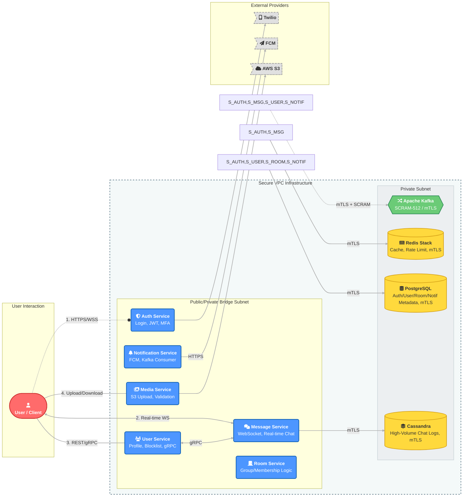

# 🚀 Lynk | Reactive Communication Platform


**Lynk** is a high-performance, event-driven, and intrinsically secure real-time communication platform built on **Kotlin** and **Spring WebFlux**. It utilizes a fully non-blocking architecture, powered by Project Reactor, to achieve superior concurrency and low-latency message throughput suitable for millions of concurrent users.

The entire system adheres to a **Zero-Trust Security Model**, mandating cryptographic proof of identity for every internal service connection.

---

## 🏗 High-Level Architecture: Zero-Trust Segmentation

The infrastructure operates with strict network segmentation, isolating all critical data stores (DBs, Kafka) from external access in a **Private Subnet**. Microservices are dual-homed, acting as secure gates between the public interface and the private data layer.



---

## 💡 Key Innovations & Design Decisions

### 1. High-Performance Persistence
*   **Cassandra Time-Series:** The `message-service` utilizes Cassandra for chat logs, with a custom `BucketUtils.kt` to implement **time-bucketed partitioning**. This prevents partitions from growing infinitely large, optimizing read/write performance for high-volume chat history retrieval across date ranges.
*   **Probabilistic Data Structures:** The `message-service` uses **Redis Cuckoo Filters** for $O(1)$ space-efficient lookups, specifically for checking room name uniqueness during creation to prevent database pressure from concurrent attempts.

### 2. Advanced Security & Validation
*   **Reactive Rate Limiting:** The `auth-service` implements a robust, script-based rate-limiting filter using **Redis and Lua scripting (`rateLimiter.lua`)**. This is applied to high-traffic public endpoints like `/login` and `/register` to mitigate DoS attacks.
*   **Internal gRPC for Validation:** The `user-service` exposes an internal gRPC service (`ValidationService`) that the `message-service` can call for high-speed, low-overhead validation checks (e.g., checking if a conversation is blocked or exists) without relying on slower HTTP or database lookups.
*   **Secure Media Workflow:** The `media-service` enforces a two-step workflow for room profile uploads, utilizing a temporary Redis entry (`CacheUtils.kt`) to ensure the uploader has the necessary permissions (implicit pre-signed URL/token mechanism), guarding against unauthorized media manipulation.

### 3. Distributed Status & Messaging
*   **Online Status Tracking:** The `message-service` uses Redis Sets (`RedisOnlineTrackerService.kt`) to maintain real-time online status of users. This service updates user connection status on WebSocket connect/disconnect (`ChatWebSocketHandler.kt`) and is used by the Kafka producer (`KafkaEventPublisher.kt`) to determine if a message should be sent to the **real-time Kafka topic** or the **notification topic**.

---
## 🔒 Security & Infrastructure

Lynk goes beyond standard security practices by implementing a hardened, defense-in-depth infrastructure strategy.

### 1. Network Segmentation (VPC)
*   **Private Subnet:** All persistence layers (Postgres, Cassandra, Redis) and the Event Bus (Kafka) reside in a strictly isolated private subnet. They are inaccessible from the public internet.
*   **Public/Private Bridge:** Microservices act as the gatekeepers. They are dual-homed: accessible via public load balancers for client traffic, but connected internally to the private subnet to access data.

### 2. Mutual TLS (mTLS) Encryption
Every internal connection requires mutual authentication. It is not enough to simply trust the network; services must cryptographically prove their identity to the databases.
*   **Implemented on:** Redis, Cassandra, PostgreSQL, and Kafka.
*   **Mechanism:** Self-signed CA governance with individual certificate generation for every service instance.

### 3. Advanced Authentication (SCRAM)
We strictly avoid cleartext passwords, utilizing Salted Challenge Response Authentication Mechanisms (SCRAM) for all connections.
*   **Kafka:** Implements **SCRAM-SHA-512** for the highest level of cryptographic strength on the event bus.
*   **Databases:** Redis, PostgreSQL, and Cassandra utilize **SCRAM-SHA-256**.

### 4. Granular Authorization (ACLs)
Implementation of the "Principle of The Least Privilege":
*   **Kafka ACLs:** Topic-level authorization is enforced.
    *   *Example:* The `notification-service` has `READ` permission on the `message.created` topic but cannot `WRITE` to it. The `auth-service` cannot access chat logs.
*   **Database RBAC:** Service users are restricted to specific tables and operations (SELECT/INSERT) relevant only to their domain.

---

## ⚡ Key Design Decisions

*   **Reactive Model (Project Reactor):** Chosen over the traditional thread-per-request model to handle high I/O wait times (DB, Network) without blocking threads, maximizing hardware utilization.
*   **Cassandra for Chat Logs:** Utilizes a Wide-Column Store for its high write throughput and ability to model time-series data (chat history) efficiently.
*   **Probabilistic Data Structures:** Implements **Redis Cuckoo Filters** for room name availability checks ($O(1)$ space-efficient lookups).
*   **Zero-Trust Architecture:** The decision to implement mTLS and SCRAM across all internal components ensures that a perimeter breach does not lead to lateral movement or data compromise.

---

## 🛠 Service Breakdown

| Service                         | Primary Stack & Persistence              | Key Functionality                                                                                                         |
|:--------------------------------|:-----------------------------------------|:--------------------------------------------------------------------------------------------------------------------------|
| **Auth Service (8081)**         | Spring WebFlux, PG, Redis, Twilio        | Registration, Login, JWT Issuance/Rotation. **Rate Limiting (Redis/Lua).**                                                |
| **User Service (8085)**         | Spring WebFlux, PG (R2DBC)               | User Profile (CRUD), Blocklist Management, **gRPC Conversation Validation (9090).**                                       |
| **Message Service (8082)**      | Spring WebFlux, **Cassandra**, **Redis** | **Real-Time 1:1 & Room Chat (WebSocket).** Cassandra message persistence with **Time-Bucketing**. Online Status Tracking. |
| **Notification Service (8083)** | Spring WebFlux, PG, Kafka, FCM           | Consumes Kafka events to send targeted **FCM/WebPush Notifications**. Registers FCM tokens via REST.                      |
| **Media Service (8084)**        | Spring WebFlux, AWS S3, Redis            | **Secure File Upload/Download.** Image Format Validation (PNG signature check). Room/User Profile workflow.               |
| **Room Service**                | Spring WebFlux, PG (R2DBC)               | Manages Room creation, `Membership` (Role/Join Date), and `BannedUser` logic.                                             |

---

## 🚀 Getting Started

### Prerequisites
*   **JDK 17+**
*   **Docker & Docker Compose** (v2.0+)
*   **OpenSSL** (Required for mTLS cert generation)

### 1. Repository Setup
```bash
git clone https://github.com/omniCoder77/Lynk.git
cd Lynk
```

### 2. Infrastructure Security Setup (Crucial)
Because Lynk runs with full security enabled, you **must** generate the mTLS certificates and credentials before starting the containers.

**Generate Root CA and Service Certificates:**
```bash
chmod +x init/*.sh
./init/generate_ca..sh
./init/generate_jwt..sh
```

**Generate Component-Specific Certs:**
```bash
./init/generate_kafka_certs.sh
./init/generate_postgres_certs.sh
./init/generate_redis_certs.sh
./init/generate_cassandra_certs.sh
```

### 3. Database Initialization
Start the persistence layer first.

```bash
docker compose up -d cassandra postgres kafka
```

**Initialize Cassandra Schema:**
```bash
mkdir -p ~/.cassandra
MY_CASSANDRA_PATH=$(pwd)
cat > ~/.cassandra/cqlshrc << EOF
certfile = $MY_CASSANDRA_PATH/init/cassandra.crt
validate = true
version = TLSv1.3
usercert = $MY_CASSANDRA_PATH/init/cassandra.crt
userkey = $MY_CASSANDRA_PATH/init/cassandra.key
EOF
docker exec -i cassandra cqlsh --ssl -u cassandra -p cassandra < init/init-cassandra.cql
```

### 4. Apply Security Configurations (ACLs)
Once Kafka is running, apply the Access Control Lists (ACLs) and SCRAM credentials. This script sets up the specific user permissions (e.g., *MessageService* can write to *ChatTopic*, *NotificationService* can only read).

```bash
docker exec kafka /usr/bin/kafka-configs --bootstrap-server localhost:9094 --alter --add-config 'SCRAM-SHA-512=[iterations=8192,password=message-service],SCRAM-SHA-512=[password=message-service]' --entity-type users --entity-name messageService
docker exec kafka /usr/bin/kafka-configs --bootstrap-server localhost:9094 --alter --add-config 'SCRAM-SHA-512=[iterations=8192,password=notification-service],SCRAM-SHA-512=[password=notification-service]' --entity-type users --entity-name notificationService
docker exec kafka /usr/bin/kafka-configs --bootstrap-server localhost:9094 --alter --add-config 'SCRAM-SHA-512=[iterations=8192,password=user-service],SCRAM-SHA-512=[password=user-service]' --entity-type users --entity-name userService
docker exec kafka /usr/bin/kafka-acls --bootstrap-server localhost:9094 --add --allow-principal User:messageService --operation Write --topic room.message --topic conversation.message --topic user.created
docker exec kafka /usr/bin/kafka-acls --bootstrap-server localhost:9094 --add --allow-principal User:notificationService --operation Read --topic room.message --topic conversation.message --topic user.created
docker exec kafka /usr/bin/kafka-acls --bootstrap-server localhost:9094 --add --allow-principal User:userService --operation Read --topic user.created
```

### 5. Launch Microservices
```bash
docker compose -f docker-compose.prod.yml up -d
```

---

## 🤝 Contributing

Contributions are welcome. Please read [CONTRIBUTING.md](CONTRIBUTING.md) for details on our code of conduct and the process for submitting pull requests.


---

## 📄 License

This project is licensed under the MIT License - see the [LICENSE](LICENSE) file for details.