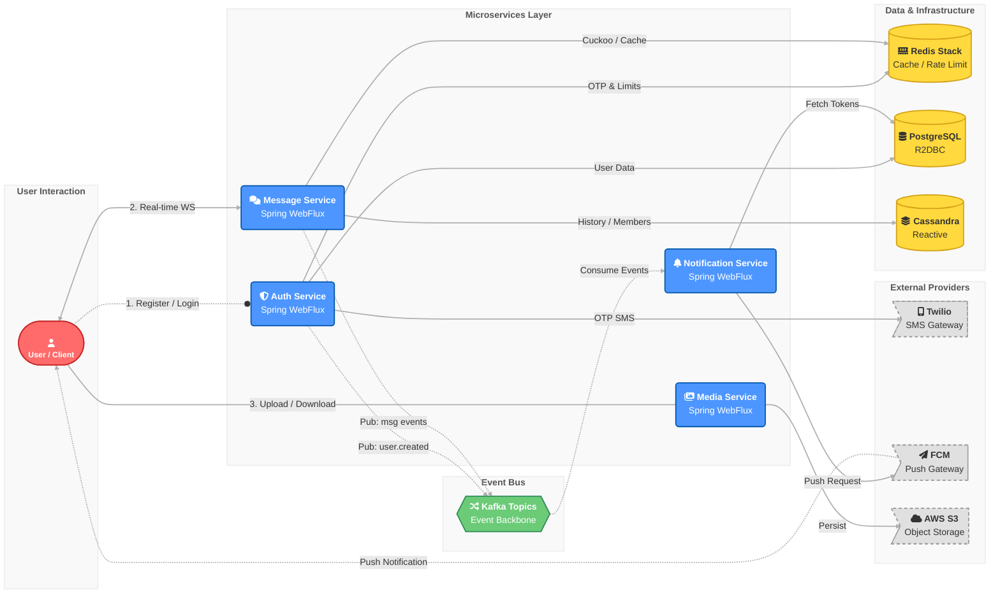

# Lynk | Reactive Communication Platform


**Lynk** is a high-performance, distributed real-time communication platform engineered on the reactive principles of **Spring WebFlux**. Designed for massive concurrency and low-latency throughput, it leverages a non-blocking event-loop architecture to handle thousands of concurrent connections with minimal resource overhead.

The system employs an event-driven architecture using **Apache Kafka** for asynchronous decoupling, **Cassandra** for write-heavy chat logs, and **Redis** for high-speed caching and probabilistic data structures.

---

## 🏗 High-Level Architecture

The platform follows a domain-driven microservices architecture. Communication between the client and services utilizes HTTP/2 and WebSockets, while inter-service communication is handled asynchronously via Kafka.



---

## ⚡ Key Design Decisions

*   **Reactive Model (Project Reactor):** Chosen over the traditional thread-per-request model to handle high I/O wait times (DB, Network) without blocking threads, maximizing hardware utilization.
*   **Cassandra for Chat Logs:** Utilizes a Wide-Column Store for its high write throughput and ability to model time-series data (chat history) efficiently using clustering keys.
*   **Probabilistic Data Structures:** Implements **Redis Cuckoo Filters** for room name availability checks. This offers $O(1)$ space-efficient lookups, significantly reducing database hits during room creation.
*   **Rate Limiting with Lua:** Atomic execution of rate-limiting logic server-side via Redis Lua scripts prevents race conditions in high-concurrency authentication scenarios.
*   **Event Sourcing via Kafka:** Decouples the critical path (messaging) from side effects (notifications), ensuring that a slow push notification service never degrades the chat experience.

---

## 🛠 Service Breakdown

### 🛡 Auth Service (`auth-service`)
The secure gateway for identity management.
*   **Stateless Auth:** Issues Access and Refresh JWTs signed with RSA keys.
*   **MFA Support:** Twilio integration for SMS OTP and TOTP (Google Authenticator) implementation.
*   **Infrastructure:** PostgreSQL (R2DBC) for relational user data; Redis for ephemeral OTP storage and token blocklisting.

### 💬 Message Service (`message-service`)
The core WebSocket engine handling bi-directional data flow.
*   **Protocol:** WebSocket over Reactor Netty.
*   **Persistence:** Cassandra tables designed for queries like "Get last 50 messages in Room X".
*   **Caching:** Redis stores active room members and user online status.

### 🔔 Notification Service (`notification-service`)
A dedicated consumer service for asynchronous alerts.
*   **Pattern:** Consumes `conversation.message` and `room.message` topics.
*   **Delivery:** Integrates with Firebase Cloud Messaging (FCM) for reliable delivery to mobile and web clients.

### 📂 Media Service (`media-service`)
Handles binary data management.
*   **Storage:** AWS S3 (via LocalStack for dev) for object storage.
*   **Security:** Presigned URLs or proxied streams to ensure media is only accessible to authorized users.

---

## 💻 Technology Stack

| Domain        | Tech                  | Rationale                                             |
|:--------------|:----------------------|:------------------------------------------------------|
| **Core**      | Kotlin, Spring Boot 3 | Null safety, coroutine support, and robust ecosystem. |
| **Reactive**  | Spring WebFlux, R2DBC | Non-blocking I/O for high concurrency.                |
| **Messaging** | Apache Kafka          | Durable event log for service decoupling.             |
| **NoSQL**     | Cassandra             | Linear scalability for write-intensive chat history.  |
| **Cache**     | Redis Stack           | Low latency caching and Cuckoo filters.               |
| **Cloud**     | AWS S3, FCM, Twilio   | Industry standard managed services.                   |

---

## 🚀 Getting Started

### Prerequisites
*   **JDK 17+**
*   **Docker & Docker Compose** (v2.0+)
*   **OpenSSL** (for certificate generation)
*   **Twilio Account** (SID & Auth Token)

### 1. Repository Setup
```bash
git clone https://github.com/omniCoder77/Lynk.git
cd Lynk
```

### 2. Configuration
Create a `.env` file in the root directory. You can copy the example:
```bash
cp .env.example .env
```

### 3. Infrastructure Security (mTLS)
Lynk enforces strict security by default. Generate the required certificates for Kafka, Postgres, and Redis:

```bash
chmod +x init/*.sh
./init/generate_jwt.sh
./init/generate_ca.sh
./init/generate_kafka_certs.sh
./init/generate_postgres_certs.sh
./init/generate_redis_certs.sh
./init/generate_cassandra_certs.sh
```

### 4. Database Initialization
Start the persistence layer first to initialize schemas.

```bash
docker compose up -d cassandra postgres kafka
```

**Initialize Cassandra Schema:**
Wait for the Cassandra container to be healthy, then run:
```bash
docker exec -it cassandra cqlsh -f /init/init-cassandra.cql
```

**Fix Postgres Permissions:**
```bash
sudo chmod 640 init/postgres/postgres.key
```

### 5. Kafka Security (ACLs & SCRAM)
Secure the message bus and create service users.

```bash
./init/create-kafka-users.sh
```
*Alternatively, run the manual `kafka-configs` commands listed in the implementation details if the script is unavailable.*

### 6. Launch Microservices
```bash
docker compose -f docker-compose.prod.yml up -d
```

---

## 🧪 Testing

To verify the deployment:

1.  **Health Checks:**
    *   Auth Service: `http://localhost:8081/actuator/health`
    *   Message Service: `http://localhost:8082/actuator/health`
2.  **WebSockets:** Connect via a WS client (e.g., Postman or wscat) to `ws://localhost:8082/chat`.

---

## 🤝 Contributing

Contributions are welcome. Please read [CONTRIBUTING.md](CONTRIBUTING.md) for details on our code of conduct and the process for submitting pull requests.

## 📄 License

This project is licensed under the MIT License - see the [LICENSE](LICENSE) file for details.