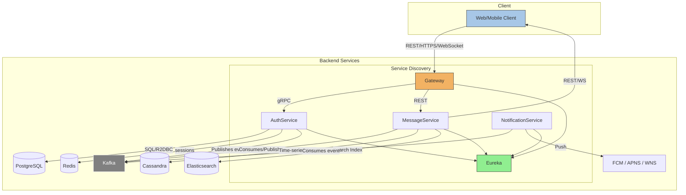

# Lynk: A Scalable, Real-Time Messaging Platform
**Lynk** is a comprehensive, backend-focused messaging application designed to demonstrate a robust, scalable, and modern microservices architecture. Built entirely with **Kotlin** and the **Spring Ecosystem**, this project showcases a decoupled, event-driven system capable of handling real-time chat, secure authentication, and push notifications.

**Note** : This project is currently under active development. The core infrastructure and key features are in place, but some components are stubbed for future completion. This README reflects both the current implementation and the planned architecture.

---
# Core Features
The platform is broken down into several distinct microservices, each with a specific responsibility:
| Service | Core Features | Status |
|---|---|---|
| **🔐 Auth Service** | - Secure user registration with SMS OTP verification (Twilio). - JWT-based authentication & refresh tokens. - Two-Factor Authentication (MFA/TOTP) with Google Authenticator. - High-performance gRPC interface for internal auth checks. | ✅ Functional |
| **💬 Message Service** | - Real-time private & group chat via WebSockets (STOMP). - Persistent, time-series message storage using Apache Cassandra. - REST API for conversation management (create groups, add/remove users). - File upload and storage capabilities. | ✅ Functional |
| **🚪 Gateway Service** | - Single entry point for all client requests. - Dynamic routing and load balancing with Spring Cloud Gateway. - Service discovery integration with Eureka. | ✅ Functional |
| **🔔 Notification Service** | - Decoupled push notification handling via Kafka events. - Pluggable provider model with adapters for FCM (functional), APNS and WNS (stubs). | ✅ Functional (FCM) |
| **🌐 Registry Service** | - Service registration and discovery using Spring Cloud Eureka. | ✅ Functional |

---
# System Architecture
Lynk employs a modern microservices architecture designed for scalability and resilience. Services communicate via a mix of gRPC for high-performance synchronous calls and a Kafka message bus for asynchronous, event-driven communication. This polyglot approach to communication and persistence ensures the right tool is used for each specific task.

```mermaid
graph TD
    subgraph Client
        direction LR
        WebApp[Web/Mobile Client]
    end

    subgraph Backend Services
        direction LR
        WebApp -- REST/HTTPS/WebSocket --> Gateway
        
        Gateway -- gRPC --> AuthService
        Gateway -- REST --> MessageService
        
        AuthService -- SQL/R2DBC --> AuthDB[(PostgreSQL)]
        AuthService -- sessions --> AuthCache[(Redis)]
        AuthService -- Publishes event --> Kafka

        MessageService -- REST/WS --> WebApp
        MessageService -- Consumes/Publishes --> Kafka
        MessageService -- Time-series Data --> MessageDB[(Cassandra)]
        MessageService -- Search Index --> SearchDB[(Elasticsearch)]

        NotificationService -- Consumes event --> Kafka
        NotificationService -- Push --> PushGateways[FCM / APNS / WNS]
        
        subgraph Service Discovery
            Gateway --> Eureka
            AuthService --> Eureka
            MessageService --> Eureka
            NotificationService --> Eureka
        end
    end

    style WebApp fill:#a7c7e7,stroke:#333
    style Gateway fill:#f2b263,stroke:#333
    style Kafka fill:#808080,stroke:#fff,color:#fff
    style Eureka fill:#90ee90,stroke:#333
```

# Key Technical Highlights & Design Patterns

This project is not just a demonstration of features, but a showcase of modern software engineering principles:

* **Reactive & Asynchronous Core**: The entire stack is built on a non-blocking, reactive foundation using **Project Reactor (Mono, Flux)** and **Kotlin Coroutines**. This ensures high throughput and efficient resource utilization, which is critical for a real-time messaging application.
* **Polyglot Persistence**: Demonstrates the "right tool for the job" philosophy by using:
    * **PostgreSQL (via R2DBC)** for relational user and authentication data in the `auth-service`.
    * **Apache Cassandra** for the high-throughput, time-series nature of chat messages in the `message-service`.
    * **Redis** for distributed caching, OTP storage, and managing temporary user login sessions.
    * **Elasticsearch** for powerful, full-text search capabilities across messages (config in place).
* **Secure by Design**: Security is a first-class citizen, featuring:
    * **JWTs** for stateless, scalable API authentication.
    * **Spring Security** for a robust and battle-tested security foundation.
    * **BCrypt** for secure password hashing.
    * **TOTP** implementation for a second factor of authentication.
* **CQRS-Inspired Design**: The `message-service` separates write models (saving a message to a conversation) from read models (querying messages by user), a pattern inspired by Command Query Responsibility Segregation (CQRS). This allows for optimized data structures for both writing and reading message data at scale.
# Tech Stack
| Category       | Technology                                                                |
|----------------|---------------------------------------------------------------------------|
| Language       | Kotlin                                                                    |
| Frameworks     | Spring Boot, Spring Cloud (Gateway, Netflix Eureka), Spring Data (Reactive R2DBC, Cassandra), Spring Security, WebFlux |
| Databases      | PostgreSQL, Apache Cassandra (Astra DB), Redis, Elasticsearch            |
| Communication  | RESTful APIs, WebSockets (STOMP), gRPC, Apache Kafka                      |
| Authentication | JWT, OAuth2 (Google Client), MFA/TOTP, BCrypt                             |
| Third-Party APIs| Twilio (for SMS), Google Firebase Cloud Messaging (FCM)                 |
| Build & Tooling| Gradle                                                                    |
# Project Status & Roadmap
This project serves as a living portfolio piece and is under continuous development.
Implemented:

* ✅ Core User Authentication & Registration Flow.
* ✅ Real-time Private Messaging via WebSockets.
* ✅ Group Conversation Management APIs.
* ✅ Service Discovery and API Gateway Routing.
* ✅ Data persistence in Redis, PostgreSQL, and Cassandra.

Future Work (Roadmap):

* ⏳ Full-Text Search: Complete the integration with Elasticsearch for fast and relevant message search.
* ⏳ User Presence: Implement real-time user online/offline status and typing indicators.
* ⏳ Push Notifications: Complete the implementation for APNS (iOS) and WNS (Windows) adapters.
* ⏳ Cloud Deployment: Containerize all services with Docker and create a docker-compose.yml for simplified local setup and cloud deployment.
* ⏳ Testing: Expand unit and integration test coverage across all services.
* ⏳ CI/CD: Implement a full continuous integration and deployment pipeline using GitHub Actions.

# Setup & Installation
As the project uses several backing services (databases, Kafka), the recommended setup method will be via Docker Compose (coming soon).

Prerequisites:
* JDK 17 or higher
* Access to PostgreSQL, Redis, Cassandra, and Kafka instances.

Configuration:
Each service contains an `application.properties` file that relies on environment variables (e.g., `${DB_URL}`, `${TWILIO_AUTH_TOKEN}`). You will need to provide these variables to your environment or run configuration to start the services successfully.

Running the Services:
* Start the `registry-service`.
* Start the remaining microservices (`auth-service`, `gateway-service`, etc.).
* The `gateway-service` will be the primary entry point, typically on port `8080`.
