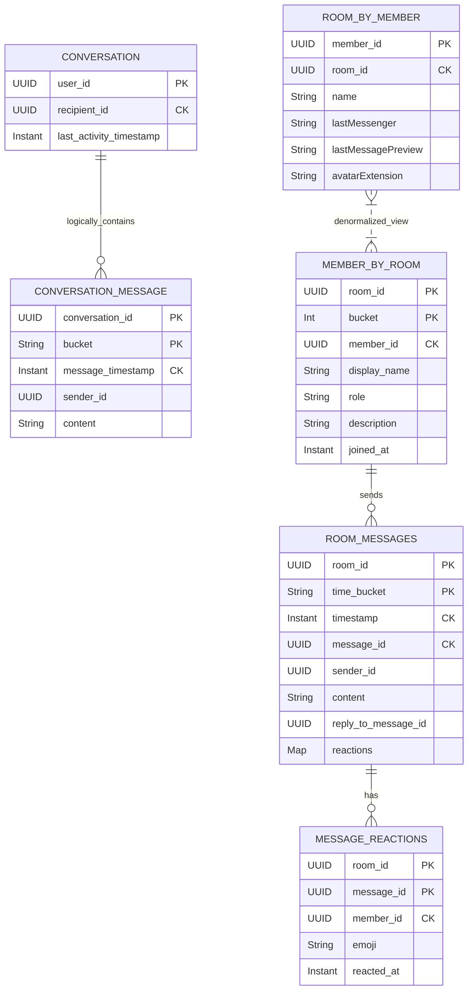

```mermaid
erDiagram
    CONVERSATION {
        UUID user_id "PK"
        UUID recipient_id "CK"
        Instant last_activity_timestamp
    }

    CONVERSATION_MESSAGE {
        UUID conversation_id "PK"
        String bucket "PK"
        Instant message_timestamp "CK"
        UUID sender_id
        String content
    }

    ROOM_BY_MEMBER {
        UUID member_id "PK"
        UUID room_id "CK"
        String name
        String lastMessenger
        String lastMessagePreview
        String avatarExtension
    }

    MEMBER_BY_ROOM {
        UUID room_id "PK"
        Int bucket "PK"
        UUID member_id "CK"
        String display_name
        String role
        String description
        Instant joined_at
    }

    ROOM_MESSAGES {
        UUID room_id "PK"
        String time_bucket "PK"
        Instant timestamp "CK"
        UUID message_id "CK"
        UUID sender_id
        String content
        UUID reply_to_message_id
        Map reactions
    }

    MESSAGE_REACTIONS {
        UUID room_id "PK"
        UUID message_id "PK"
        UUID member_id "CK"
        String emoji
        Instant reacted_at
    }

    CONVERSATION ||--o{ CONVERSATION_MESSAGE : "logically_contains"
    ROOM_BY_MEMBER }|..|{ MEMBER_BY_ROOM : "denormalized_view"
    MEMBER_BY_ROOM ||--o{ ROOM_MESSAGES : "sends"
    ROOM_MESSAGES ||--o{ MESSAGE_REACTIONS : "has"
```